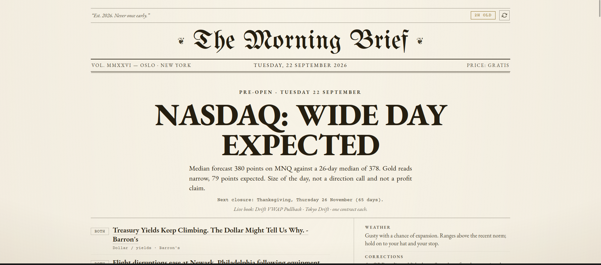
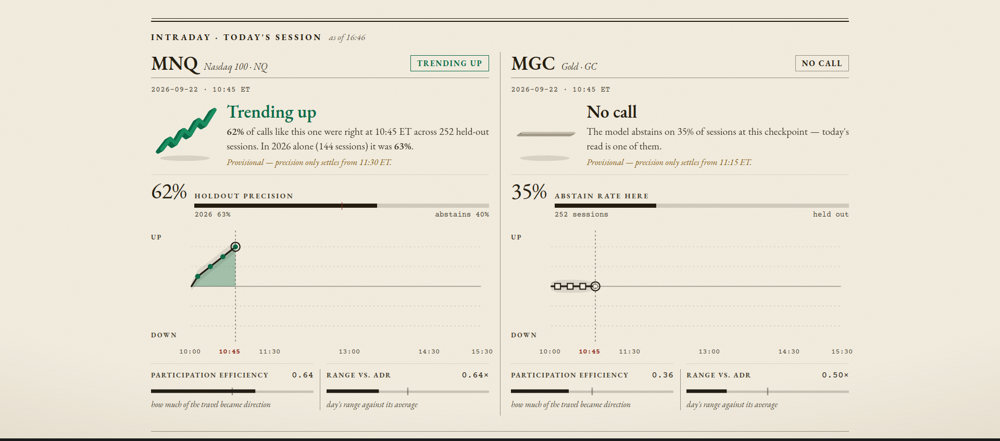
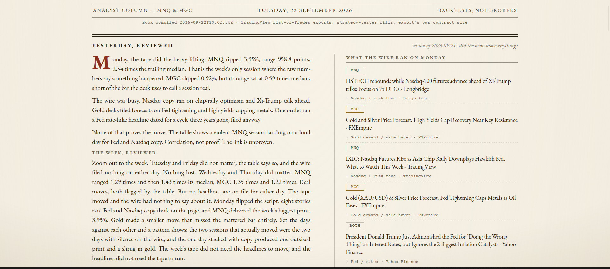

# The Morning Brief

A pre-open trading page for two futures contracts, MNQ (Micro E-mini Nasdaq-100) and MGC
(Micro Gold), typeset as a broadsheet newspaper.

Live at **[brief.mwmai.no](https://brief.mwmai.no/)**.



The page answers one question before the bell: how big is today likely to be, and does
anything on the calendar or the tape argue against trading it. It never calls direction,
never posts a profit target, and never places an order. Every number on it is either read
from a public API or computed from a held-out backtest, and the page says which.

## The two pages

### Front page

The lead headline is a range forecast, not a prediction of up or down. Under it:

| Section | What it shows |
|---|---|
| Page one | Pre-open range forecast against the 26-day median, the next exchange closure, and the strategies running today |
| The Week Ahead | A weekly master read on MNQ, refreshed each weekday pre-open, with a second model auditing the first and the audit verdict always printed |
| Trading wire | The last 24 hours of news filtered to things that move MNQ or MGC, each item tagged MNQ, MGC or BOTH |
| Live charts | MNQ and MGC 5-minute candles with prior-day and overnight levels in the footer |
| Pre-open expansion | At 08:00 Oslo, whether today's range beats its 26-day median. It calls only above 1.15x or below 0.80x and abstains between, which is what lifts the called days from 63.9% to 87% and 70% |
| Regime lens | The 15:25 Oslo read. Two pre-registered survivors: next-session range regime (65.2% over 5 years against 58.9% for persistence) and prior-day high/low first-touch geometry. Trend, chop and direction are deliberately absent because all three measured null |
| Intraday nowcast | A 15-minute producer scoring the session in flight, validated on 252 held-out sessions |
| Regime | Structural backdrop over weeks to months: trend, volatility, credit and four tripwires, over a VIX chart back to 2012 |
| Scheduled | US macro events for the next 7 days, because a regime read that ignores an 08:30 ET CPI print is misleading |
| Back pages | Tech and AI, research, and a self-calibration progress strip drawn as a comic |



Every nowcast panel carries its own precision from the held-out sample and its abstain
rate, so a confident-looking arrow can be read against how often that call has been right.
On the day above the MNQ panel reads 62% precision across 252 held-out sessions while MGC
abstains, which is what the model does on 35% of sessions at that checkpoint.

### The Strategy Desk (`analyst.html`)

A second page that looks backwards instead of forwards.



- **Yesterday, reviewed.** What the session actually did, in points and as a multiple of
  the trailing median range, set against every headline the wire ran that day. The column
  states plainly when the tape moved and the news had nothing to do with it, and when a
  loud news day produced nothing. Correlation is named as correlation.
- **The week, reviewed.** The same treatment across five sessions, so the days that
  mattered can be told apart from the days that only looked busy.
- **The book.** A 90-day backtest column per strategy, live, benched and retired, with a
  verdict on which retired ones could come back. Every figure is read from that strategy's
  own TradingView list-of-trades export, at the export's own contract size and the strategy
  tester's own fills. The masthead says "backtests, not brokers" because that is the claim.

## How it is built

`builder.py` fetches every section in parallel, summarises the news through a Groq model,
validates the result against a JSON schema, writes `web/brief.json` atomically, and rsyncs
the `web/` tree to a VPS behind Caddy. The page itself is static HTML plus vanilla JS that
reads the JSON. No framework, no build step for the front end.

```
builder.py            orchestrator: fetch, summarise, validate, atomic write, deploy
config.py             env and paths, read from a single .env
schema.py             brief.json shape and empty-section helpers
strategy.py           regime to strategy picker
llm.py                Groq summarisation wrapper
headlines.py          page-one headline selection
machine_readable.py   llms.txt and the structured-data endpoints
fetchers/             one module per section (28 of them)
systemd/              user timers and services
web/                  the static site that gets deployed
  index.html          front page
  analyst.html        The Strategy Desk
  week-ahead.html     the full weekly edition
  assets/             style.css plus one JS module per section
```

Runtime outputs (`web/brief.json`, `web/bars_*.json`, `logs/`) are gitignored. They are
regenerated on every build.

### Quality gate on the summaries

Every summarised bullet passes five deterministic checks before an LLM judge ever sees it:
JSON schema, URL provenance, a source index on every bullet, lede length and bullet length.
Only then does the judge score it against a rubric, and a bullet that fails is compressed or
dropped rather than published. A bullet with no traceable source never reaches the page.

## Schedule (Europe/Oslo)

| When | What |
|---|---|
| every 5 min, Mon to Fri | MNQ and MGC candle refresh |
| 06:40 Oslo and 17:30 UTC | full rebuild and deploy |
| 08:15 Mon to Fri | rebuild after the London detector fires |
| 15:00 Mon to Fri | rebuild after the New York detector fires |
| 22:00 UTC | regime monitor refresh, VIX chart and the four-row panel |

## Running it yourself

```bash
python3 builder.py              # build and deploy
python3 builder.py --dry-run    # print to stdout, touch nothing
python3 builder.py --no-llm     # skip the summariser
python3 builder.py --no-deploy  # build locally, do not rsync
```

Python 3.11, `requests` and `pandas`. Configuration comes from a `.env` file outside the
repo. Nothing here is hardcoded to one machine or one host.

| Key | Used for |
|---|---|
| `GROQ_API_KEY` | news summarisation |
| `FINNHUB_API_KEY` | market news |
| `FRED_API_KEY` | macro series |
| `BRIEF_VPS_TARGET` | rsync destination, `user@host:/path` |
| `BRIEF_OUT_DIR` | output directory, defaults to `web/` |

Without the keys the build still runs and the affected sections render empty rather than
failing, which is the design: a missing section is honest, a fabricated one is not.

## Sources

- **Price**: CME real-time bars through the TopstepX Python SDK, with Yahoo quotes as the
  fallback and for the index, VIX, 10-year and dollar-index reads.
- **News**: Finnhub, plus GDELT tone and arXiv q-fin for the back pages.
- **Macro**: FRED and the BLS.
- **Regime**: a local market-detector package plus FRED's VIX series back to 2012.
- **Strategy figures**: TradingView list-of-trades exports, parsed as-is. No hand-edited
  statistics appear anywhere on the site.

## What this is not

It is not advice, not a signal service, and not a broker. It does not execute anything.
The page is display-only by design: the reader flips the switch, never the page. Strategy
names and backtest figures are published so they can be checked, not so they can be copied.

## Licence

MIT. See [LICENSE](LICENSE).
