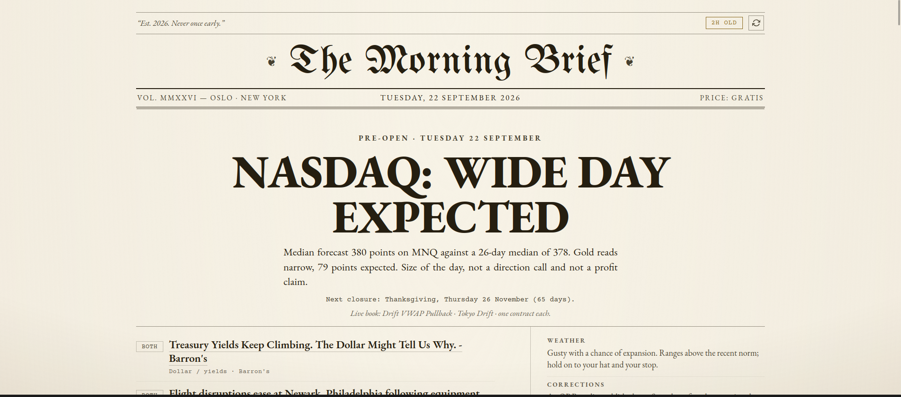
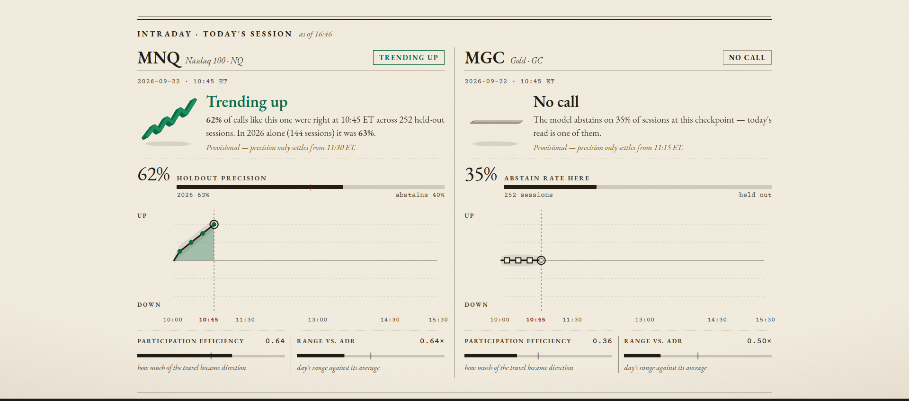
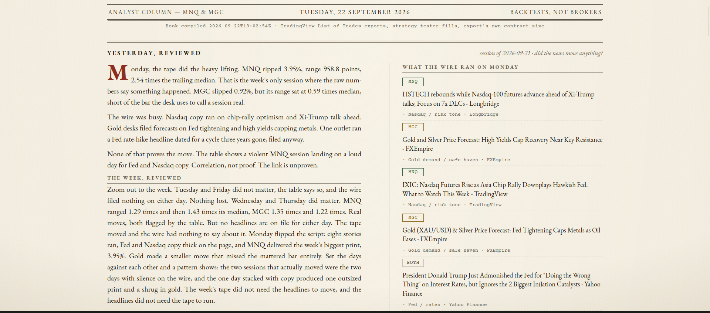

# The Morning Brief

A pre-open trading page for two futures contracts, MNQ (Micro E-mini Nasdaq-100) and MGC
(Micro Gold), typeset as a broadsheet newspaper.

Live at **[brief.mwmai.no](https://brief.mwmai.no/)**.



The page answers one question before the bell: how big is today likely to be, and does
anything on the calendar or the tape argue against trading it. It never calls direction,
never posts a profit target, and never places an order. Every number on it is either read
from a public API or computed from a held-out backtest, and the page says which.

## The two pages

### Front page

The lead headline is a range forecast, not a prediction of up or down, unless a market
closure or a tier-1 US release outranks it. Under it:

| Section | What it shows |
|---|---|
| Page one | Pre-open range forecast against the 26-day median, three sub-headlines from the trading wire, the next exchange closure, and the strategies running today, under a masthead with a rotating motto and the day's weather. The lead headline is picked from a pool that rotates by day; a template whose figures the feed cannot fill is skipped |
| The Week Ahead | A weekly master read on MNQ and MGC, a WIDE or NARROW range call each, refreshed each weekday pre-open, with a second model auditing the first and the audit verdict always printed |
| Trading wire | The last 24 hours of news filtered to things that move MNQ or MGC, each item tagged MNQ, MGC or BOTH |
| Live charts | MNQ and MGC 5-minute candles with prior-day and overnight levels in the footer |
| Market cards | Market, Gold & Metals and Geopolitics, up to five bullets each |
| Pre-open expansion | At 08:00 Oslo, whether today's range beats its 26-day median. Graded, not abstaining: every day gets a call, and the rung it lands on carries that rung's walk-forward hit rate (63.9% over all 1,719 days). The extreme rungs are thresholds picked on that same run, not a separate test. MNQ also carries an opening-range-breakout (ORB) go/no-go badge, which is not a claim about ORB profit. A second read at 08:00 ET adds the observed overnight range and an updated MNQ call |
| Regime lens | The 15:25 Oslo read. Two pre-registered survivors: a range call (NARROW, NO CALL or WIDE against the trailing 20-session median, each call carrying its walk-forward hit rate, from a range regime that scored 65.2% over 5 years against 58.9% for persistence) and prior-day high/low first-touch geometry. The first-touch card is labelled as geometry because the nearer level came first 77.6% of the time, the same rate a random walk gives, and it makes no call when price already sits beyond a level at 09:24 ET. Trend/chop and direction are deliberately absent because both measured null |
| Intraday nowcast | The day so far, labelled a description and not a forecast. A 15-minute producer classifies the session in flight as trending up, trending down, chopping or no call, validated on 252 held-out sessions |
| Today's Play | A verdict for each live strategy (RUN or SKIP) beside the day's calendar. Tier-1 releases are listed, not gated, and FOMC decision days read SKIP by house rule |
| Regime | Structural backdrop over weeks to months: trend, volatility, credit and four tripwires, over a VIX chart back to 2012 |
| Scheduled | US macro events for the next 7 days, because a regime read that ignores an 08:30 ET CPI print is misleading |
| Back pages | Tech and AI, research, consciousness and system-health cards, and the Funny Pages, a self-calibration progress strip drawn as a comic with four gags that rotate daily |



Every nowcast panel carries its own precision from the held-out sample (with the number of
held-out calls behind it and the current year's figure beside the blended one) and its
abstain rate, so a confident-looking arrow can be read against how often that call has been
right. On the day above the MNQ panel reads 62% precision across 252 held-out sessions, 63%
in 2026 alone, while MGC abstains, which is what the model does on 35% of sessions at that
checkpoint.

### The Strategy Desk (`analyst.html`)

A second page that looks backwards instead of forwards.



- **Yesterday, reviewed.** What the session actually did, in points and as a multiple of
  the trailing median range, set against every headline the wire ran that day. The column
  states plainly when the tape moved and the news had nothing to do with it, and when a
  loud news day produced nothing. Correlation is named as correlation.
- **The week, reviewed.** The same treatment across five sessions, so the days that
  mattered can be told apart from the days that only looked busy.
- **The book.** A 90-day backtest column per strategy, live, benched and retired, with a
  verdict on which retired ones could come back. Every figure is read from that strategy's
  own TradingView list-of-trades export, at the export's own contract size and the strategy
  tester's own fills. The masthead says "backtests, not brokers" because that is the claim.

## How it is built

`builder.py` fetches the nine news and market sections in parallel, reads the regime,
pre-open, lens and Week Ahead artifacts that separate jobs produce, summarises the news
through a Groq model, composes page one, writes `web/brief.json` atomically, and rsyncs
the `web/` tree to a VPS behind Caddy. The page itself is static HTML plus vanilla JS that
reads the JSON. No framework, no build step for the front end.

```
builder.py            orchestrator: fetch, summarise, compose, atomic write, deploy
config.py             env and paths, read from ~/MWM/.env
schema.py             brief.json shape, empty-section helper and the atomic writer
strategy.py           Today's Play card for the live strategy pair, plus a legacy regime picker
llm.py                summarisation wrapper and the check-and-judge loop
headlines.py          page-one lead headline, motto, weather and corrections box, rotated by day
machine_readable.py   llms.txt, robots.txt, sitemap.xml and the noscript summary
bar_refresh.sh        5-minute MNQ and MGC bar refresh, run by a systemd timer
recompute_selfcalib.py  scores the self-calibration dimensions against selfcalib_rubric.yaml
fetchers/             27 modules: one per section, plus bar, level and Reddit helpers
data/tv_exports/      TradingView list-of-trades exports behind the Strategy Desk
tests/                pytest suite
systemd/              user timers and services
web/                  the static site that gets deployed
  index.html          front page
  analyst.html        The Strategy Desk
  week-ahead.html     the full weekly edition
  assets/             style.css, a vendored charting library and one JS module per section
```

Most runtime outputs (`web/brief.json`, `web/bars_mnq.json`, `web/regime.json`,
`web/book.json`, `web/review.json`, `web/nq/`, `logs/`) are gitignored and regenerated by the
build or its timers. `web/bars_mgc.json` and `web/selfcalib.json` are committed snapshots
that the same jobs overwrite.

### Quality gate on the summaries

Every summary goes through a compress-and-judge loop. Five deterministic checks run first:
JSON schema, URL provenance, a source index on every bullet, lede length and bullet length.
A failed check sends targeted feedback back to the model, for up to two refinements. Only
a candidate that passes the checks reaches the LLM judge, which scores it against a rubric.
The loop fails open: if no candidate is accepted the best one is kept, and if the
summariser is unavailable the raw fetcher items are shown instead. `BRIEF_MEMENTO=0`
bypasses the loop and restores single-shot summarisation.

## Schedule (Europe/Oslo)

| When | What |
|---|---|
| every 5 min, Mon to Fri | MNQ and MGC candle refresh, plus the MNQ prior-session levels |
| 06:40 Oslo and 17:30 UTC | full rebuild and deploy |
| 08:15 Mon to Fri | rebuild after the London detector fires |
| 15:00 Mon to Fri | rebuild after the New York detector fires |
| 22:00 UTC | regime monitor refresh, VIX chart and the four-row panel |

## Running it yourself

```bash
python3 builder.py              # build and deploy
python3 builder.py --dry-run    # print brief.json to stdout, do not write it or deploy
python3 builder.py --no-llm     # skip the summariser
python3 builder.py --no-deploy  # build locally, do not rsync
```

A dry run still refreshes the side files the fetchers keep (`web/book.json`,
`web/review.json`, `web/nq/`, `data/news_ledger.jsonl` and `logs/`).

Python 3.11, `requests`, `beautifulsoup4` and `pyyaml`, plus `pytest` for the tests.
Configuration comes from `~/MWM/.env`, outside the repo, and `config.py` refuses to start
if that file is missing. Paths assume the checkout lives at `~/MWM/projects/mwm-morning-brief`
(the systemd units use it), and `llm.py` imports the summariser backend and the judge loop
from a shared `core/` folder under `~/MWM`. `fetchers/reddit_feed.py` reads Reddit through
the paced, cached RSS client in the same folder; without it the Reddit items are left out.
No host is hardcoded: the deploy target comes from the environment.

| Key | Used for |
|---|---|
| `GROQ_API_KEY` | news summarisation |
| `FINNHUB_API_KEY` | market news |
| `FRED_API_KEY` | macro series |
| `BRIEF_VPS_TARGET` | rsync destination, `user@host:/path` |
| `BRIEF_OUT_DIR` | output directory, defaults to `web/` |
| `MWM_AI_ROOT` | workspace root for the pre-open, lens and Week Ahead artifacts, defaults to `~/MWM` |
| `PROJECT_X_API_KEY`, `PROJECT_X_USERNAME` | optional real-time bar path; without them the 5-minute refresh falls back to Yahoo |

Without the keys the build still runs and the affected sections render empty rather than
failing, which is the design: a missing section is honest, a fabricated one is not. Without
`BRIEF_VPS_TARGET` the page is built locally and the run exits 2 unless `--no-deploy` is given.

## Sources

- **Price**: CME real-time bars through `project-x-py` (TopstepX / ProjectX gateway), with
  Yahoo quotes as the fallback and for the index, VIX, 10-year and dollar-index reads.
- **News**: Finnhub and Google News RSS for the wire and the market cards, GDELT tone for
  geopolitics, Hacker News, Reddit (hot RSS feeds) and arXiv for the back pages.
- **Macro**: the TradingEconomics calendar and the Fed's FOMC calendar for the schedule,
  FRED for the VIX, high-yield spread and 10y-2y spread.
- **Regime**: FRED (VIX back to 2012) and Yahoo (S&P 500, VIX3M) for the structural
  monitor, plus a local market-detector package.
- **Strategy figures**: TradingView list-of-trades exports, parsed as-is. No hand-edited
  statistics appear anywhere on the site.

## What this is not

It is not advice, not a signal service, and not a broker. It does not execute anything.
The page is display-only by design: the reader flips the switch, never the page. Strategy
names and backtest figures are published so they can be checked, not so they can be copied.

## Licence

MIT. See [LICENSE](LICENSE).
